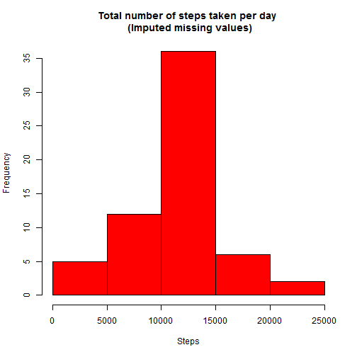

------


Assessment 1
=============


------

<br >


##Introduction
<br >

    It is now possible to collect a large amount of data about personal movement using activity monitoring devices such as a Fitbit, Nike Fuelband, or Jawbone Up. These type of devices are part of the "quantified self" movement - a group of enthusiasts who take measurements about themselves regularly to improve their health, to find patterns in their behavior, or because they are tech geeks. But these data remain under-utilized both because the raw data are hard to obtain and there is a lack of statistical methods and software for processing and interpreting the data.

    This assignment makes use of data from a personal activity monitoring device. This device collects data at 5 minute intervals through out the day. The data consists of two months of data from an anonymous individual collected during the months of October and November, 2012 and include the number of steps taken in 5 minute intervals each day.
    
<br >

------

<br >

##Loading and preprocessing the data
<br >

**Load the data (i.e. read.csv()) and process/transform the data (if necessary) into a format suitable for your analysis**


```r
mydata = read.csv("activity.csv")  # read csv file 
names(mydata)
```

```
## [1] "steps"    "date"     "interval"
```

```r
head(mydata)
```

```
##   steps       date interval
## 1    NA 2012-10-01        0
## 2    NA 2012-10-01        5
## 3    NA 2012-10-01       10
## 4    NA 2012-10-01       15
## 5    NA 2012-10-01       20
## 6    NA 2012-10-01       25
```

```r
summary(mydata)
```

```
##      steps                date          interval     
##  Min.   :  0.00   2012-10-01:  288   Min.   :   0.0  
##  1st Qu.:  0.00   2012-10-02:  288   1st Qu.: 588.8  
##  Median :  0.00   2012-10-03:  288   Median :1177.5  
##  Mean   : 37.38   2012-10-04:  288   Mean   :1177.5  
##  3rd Qu.: 12.00   2012-10-05:  288   3rd Qu.:1766.2  
##  Max.   :806.00   2012-10-06:  288   Max.   :2355.0  
##  NA's   :2304     (Other)   :15840
```

<br >

------

<br >

##What is mean total number of steps taken per day?
<br >


**1. Calculate the total number of steps taken per day**


```r
sumdata <- aggregate(mydata$steps, by=list(mydata$date), FUN=sum, na.rm=TRUE)
names(sumdata) <- c("date", "totalsteps")
summary(sumdata)
```

```
##          date      totalsteps   
##  2012-10-01: 1   Min.   :    0  
##  2012-10-02: 1   1st Qu.: 6778  
##  2012-10-03: 1   Median :10395  
##  2012-10-04: 1   Mean   : 9354  
##  2012-10-05: 1   3rd Qu.:12811  
##  2012-10-06: 1   Max.   :21194  
##  (Other)   :55
```
<br >


**2. Make a histogram of the total number of steps taken each day**


```r
#Make plot
hist(sumdata$totalsteps, main="Total number of steps taken per day", xlab="Steps", col="red")
```

 
<br >

**3. Calculate and report the mean and median of the total number of steps taken per day**


```r
mean(sumdata$totalsteps)
```

```
## [1] 9354.23
```

```r
median(sumdata$totalsteps)
```

```
## [1] 10395
```

<br >

------

<br >

##What is the average daily activity pattern?
<br >

**1. Make a time series plot (i.e. type = "l") of the 5-minute interval (x-axis) and the average number of steps taken, averaged across all days (y-axis)**


```r
meandata <- aggregate(mydata$steps, by=list(mydata$interval), FUN=mean, na.rm=TRUE)
names(meandata) <- c("interval","meansteps")
summary(meandata)
```

```
##     interval        meansteps      
##  Min.   :   0.0   Min.   :  0.000  
##  1st Qu.: 588.8   1st Qu.:  2.486  
##  Median :1177.5   Median : 34.113  
##  Mean   :1177.5   Mean   : 37.383  
##  3rd Qu.:1766.2   3rd Qu.: 52.835  
##  Max.   :2355.0   Max.   :206.170
```

```r
#Make plot
plot(meandata$interval, meandata$meansteps, type="l", main="Average daily activity pattern", xlab="5-minute interval", ylab="Average number of steps taken")
```

 
<br >

**2. Which 5-minute interval, on average across all the days in the dataset, contains the maximum number of steps?**


```r
meandata[order(-meandata$meansteps),][1,1]
```

```
## [1] 835
```

<br >

------

<br >

##Imputing missing values
<br >

Note that there are a number of days/intervals where there are missing values (coded as `NA`). The presence of missing days may introduce bias into some calculations or summaries of the data.
<br >
<br >

**1. Calculate and report the total number of missing values in the dataset (i.e. the total number of rows with NAs)**


```r
sum(is.na(mydata$steps))
```

```
## [1] 2304
```
<br >

**2. Devise a strategy for filling in all of the missing values in the dataset. The strategy does not need to be sophisticated. For example, you could use the mean/median for that day, or the mean for that 5-minute interval, etc.**

*I'll use the the mean for the interval for filling in all of the missing values in the dataset*
<br >
<br >


**3. Create a new dataset that is equal to the original dataset but with the missing data filled in.**


```r
mydata2 <- mydata
for (i in 1:nrow(mydata2)) {
  if (is.na(mydata2$steps[i])) {
    mydata2$steps[i] <- meandata[which(mydata2$interval[i] == meandata$interval), ]$meansteps
  }
}
```

*You can evaluate that there's no NA with `sum(is.na(mydata2$steps))`.*
<br >
<br >


**4a. Make a histogram of the total number of steps taken each day**


```r
sumdata2 <- aggregate(mydata2$steps, by=list(mydata2$date), FUN=sum, na.rm=TRUE)
names(sumdata2) <- c("date", "totalsteps")
summary(sumdata2)
```

```
##          date      totalsteps   
##  2012-10-01: 1   Min.   :   41  
##  2012-10-02: 1   1st Qu.: 9819  
##  2012-10-03: 1   Median :10766  
##  2012-10-04: 1   Mean   :10766  
##  2012-10-05: 1   3rd Qu.:12811  
##  2012-10-06: 1   Max.   :21194  
##  (Other)   :55
```

```r
#Make plot
hist(sumdata2$totalsteps, main="Total number of steps taken per day \n (Imputed missing values)", xlab="Steps", col="red")
```

 
<br >

**4b. Calculate and report the mean and median total number of steps taken per day.**


```r
mean(sumdata2$totalsteps)
```

```
## [1] 10766.19
```

```r
median(sumdata2$totalsteps)
```

```
## [1] 10766.19
```

<br >

------

<br >

##Are there differences in activity patterns between weekdays and weekends?

<br >
For this part the `weekdays()` function may be of some help here. Use the dataset with the filled-in missing values for this part.
<br >  
<br >


**1. Create a new factor variable in the dataset with two levels - "weekday" and "weekend" indicating whether a given date is a weekday or weekend day.**


```r
mydata3 <- mydata2
mydata3$daytype <- factor(ifelse(weekdays(as.Date(mydata3$date)) %in% c("Saturday", "Sunday"), "weekend", "weekday"))
summary(mydata3)
```

```
##      steps                date          interval         daytype     
##  Min.   :  0.00   2012-10-01:  288   Min.   :   0.0   weekday:12960  
##  1st Qu.:  0.00   2012-10-02:  288   1st Qu.: 588.8   weekend: 4608  
##  Median :  0.00   2012-10-03:  288   Median :1177.5                  
##  Mean   : 37.38   2012-10-04:  288   Mean   :1177.5                  
##  3rd Qu.: 27.00   2012-10-05:  288   3rd Qu.:1766.2                  
##  Max.   :806.00   2012-10-06:  288   Max.   :2355.0                  
##                   (Other)   :15840
```
<br >

**2. Make a panel plot containing a time series plot (i.e. type = "l") of the 5-minute interval (x-axis) and the average number of steps taken, averaged across all weekday days or weekend days (y-axis).**


```r
sumdata3 <- aggregate(mydata3$steps, by=list(mydata3$daytype, mydata3$interval), FUN=mean, na.rm=TRUE)
names(sumdata3) <- c("daytype", "interval", "meansteps")
summary(sumdata3)
```

```
##     daytype       interval        meansteps      
##  weekday:288   Min.   :   0.0   Min.   :  0.000  
##  weekend:288   1st Qu.: 588.8   1st Qu.:  2.047  
##                Median :1177.5   Median : 28.133  
##                Mean   :1177.5   Mean   : 38.988  
##                3rd Qu.:1766.2   3rd Qu.: 61.263  
##                Max.   :2355.0   Max.   :230.378
```

```r
library(lattice)

#Make plot
xyplot(meansteps~interval|daytype,data=sumdata3,xlab="Interval", ylab="Number of steps",type="l",layout=c(1,2))
```

 


------


